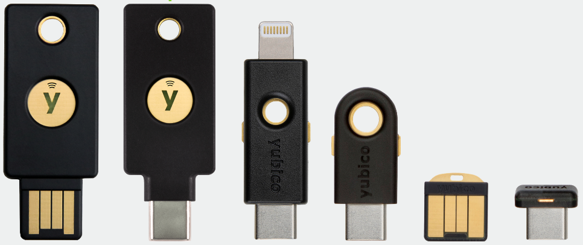

# sc25519 -- a Python library for OpenPGP smartcards that support ed25519/x25519 operations

Several decentralized web projects like [Secure
Scuttlebutt](https://scuttlebutt.nz/), Hypercore or IPFS have adopted
ed25519 for signing and key exchange, typically assuming that the
secret key is directly accessible to their software.

Using hardware tokens like the [Yubikey
5](https://www.yubico.com/products/yubikey-5-overview/), the secret
key can be offloaded and all operations using that key can be done in
the token. This prevents that secret keys end up unencrypted in
backups where they do not belong.

Because these smartcard tokens can also store small amounts of user
data, it is possible to keep state, for example the tip of a hash
chain, which can help to avoid accidental forks.  Even wilder
application scenarios can be thought of with F-Secure's
[GoKey](https://github.com/f-secure-foundry/GoKey) where application
logic could be put on their security hardware token.

## Contribution

The hard part was to collect and interpret the various specs (or lack
thereof), even do reverse engineering in GPG and perform blackbox
experiments with the Yubikey 5...

At the end, we got all smartcard codes right, found out that the
Yubikey wants the DH secret in big-endian format instead of the little
endian encoding of curve25519, and perhaps even discovered an error in
an Internet standard - this is currently being reviewed.

I hope that the crystallized knowledge in this library helps to write
similar access software in other languages (Go, JavaScript and WebUSB),
leading to better operational security of decentralized web projects.
